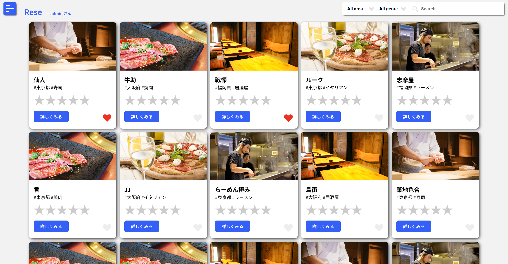

# Rese

## 概要

Rese は、予約管理システムです。ユーザーが予約を簡単に管理できるようにするための機能を提供します。

## 機能一覧

### ユーザー関連機能

- ホームページ表示
- ショップ詳細表示
- お気に入り登録
- マイページ表示
- レビュー表示
- レビュー更新

### 予約関連機能

- 予約作成
- 予約削除
- 予約変更

### 管理者関連機能

- 管理ページ表示
- ユーザー情報更新
- ユーザー削除
- ショップ登録
- ショップ更新
- ショップ削除

### 通知関連機能

- メール通知送信

### 支払い関連機能

- 事前決済ページ

### メール認証関連機能

- メール認証
- メール認証通知再送

## 使用技術

- Docker
- Laravel:8.83.8
- Fortify:1.19.1
- MailHog
- nginx:1.21.1
- php:7.4.9
- MySQL:8.0.26
- phpMyAdmin

## ER 図

## テーブル設計

### authorities

| カラム名   | 型              | 説明                                  |
| ---------- | --------------- | ------------------------------------- |
| id         | UNSIGNED BIGINT | 主キー、自動インクリメント            |
| authority  | INTEGER         | 1: 管理者 / 2: 店舗代表者 / 3: 利用者 |
| created_at | TIMESTAMP       | レコード作成日時                      |
| updated_at | TIMESTAMP       | レコード更新日時                      |

### users

| カラム名                  | 型              | 説明                                  |
| ------------------------- | --------------- | ------------------------------------- |
| id                        | UNSIGNED BIGINT | 主キー、自動インクリメント            |
| authority_id              | UNSIGNED BIGINT | 外部キー、`authorities`テーブルに関連 |
| name                      | VARCHAR(255)    | ユーザーの名前                        |
| email                     | VARCHAR(255)    | ユニークなメールアドレス              |
| email_verified_at         | TIMESTAMP       | メールアドレス確認日時                |
| password                  | VARCHAR(255)    | パスワード                            |
| tow_factor_secret         | text            |                                       |
| tow_factor_recovery_codes | text            |                                       |
| tow_factor_confirmed_at   | TIMESTAMP       |                                       |
| remember_token            | VARCHAR(100)    |                                       |
| created_at                | TIMESTAMP       | レコード作成日時                      |
| updated_at                | TIMESTAMP       | レコード更新日時                      |
| stripe_id                 | VARCHAR(255)    |                                       |
| pm_type                   | VARCHAR(255)    |                                       |
| pm_last_four              | VARCHAR(4)      |                                       |
| trial_ends_at             | TIMESTAMP       |                                       |

#### Users テーブルのデフォルトユーザーについて

以下のデフォルトユーザーが登録されています。
各ユーザーのメールアドレスとパスワードについては別途資料を確認してください。
|id|デフォルトユーザー名|説明|設定環境|
|----|----|----|----|
|1|admin|管理者権限のユーザー|本番、開発両方の環境で設定されます|
|2|testManager|店舗代表者権限のテスト用ユーザー|開発環境でのみ設定されます|
|3|testUser1|利用者権限のテスト用ユーザー|開発環境でのみ設定されます|
|4|testUser2|利用者権限のテスト用ユーザー|開発環境でのみ設定されます|
|5|testUser3|利用者権限のテスト用ユーザー|開発環境でのみ設定されます|

### areas

| カラム名   | 型              | 説明                       |
| ---------- | --------------- | -------------------------- |
| id         | UNSIGNED BIGINT | 主キー、自動インクリメント |
| area       | VARCHAR(255)    | エリア名                   |
| created_at | TIMESTAMP       | レコード作成日時           |
| updated_at | TIMESTAMP       | レコード更新日時           |

### categories

| カラム名   | 型              | 説明                       |
| ---------- | --------------- | -------------------------- |
| id         | UNSIGNED BIGINT | 主キー、自動インクリメント |
| category   | VARCHAR(255)    | カテゴリー名               |
| created_at | TIMESTAMP       | レコード作成日時           |
| updated_at | TIMESTAMP       | レコード更新日時           |

### shops

| カラム名    | 型              | 説明                                 |
| ----------- | --------------- | ------------------------------------ |
| id          | UNSIGNED BIGINT | 主キー、自動インクリメント           |
| user_id     | UNSIGNED BIGINT | 外部キー、`users`テーブルに関連      |
| name        | VARCHAR(255)    | 店舗名                               |
| area_id     | UNSIGNED BIGINT | 外部キー、`areas`テーブルに関連      |
| category_id | UNSIGNED BIGINT | 外部キー、`categories`テーブルに関連 |
| profile     | TEXT            | 店舗のプロフィール                   |
| image_url   | TEXT            | 画像 URL、null 許可                  |
| created_at  | TIMESTAMP       | レコード作成日時                     |
| updated_at  | TIMESTAMP       | レコード更新日時                     |

### favorites

| カラム名   | 型              | 説明                            |
| ---------- | --------------- | ------------------------------- |
| id         | UNSIGNED BIGINT | 主キー、自動インクリメント      |
| user_id    | UNSIGNED BIGINT | 外部キー、`users`テーブルに関連 |
| shop_id    | UNSIGNED BIGINT | 外部キー、`shops`テーブルに関連 |
| created_at | TIMESTAMP       | レコード作成日時                |
| updated_at | TIMESTAMP       | レコード更新日時                |

### reservations

| カラム名       | 型              | 説明                               |
| -------------- | --------------- | ---------------------------------- |
| id             | UNSIGNED BIGINT | 主キー、自動インクリメント         |
| user_id        | UNSIGNED BIGINT | 外部キー、`users`テーブルに関連    |
| shop_id        | UNSIGNED BIGINT | 外部キー、`shops`テーブルに関連    |
| date           | DATE            | 予約日                             |
| time           | TIME            | 予約時間                           |
| number         | INTEGER         | 予約人数                           |
| paid_online_at | TIMESTAMP       | オンライン支払い日時、null 許可    |
| created_at     | TIMESTAMP       | レコード作成日時                   |
| updated_at     | TIMESTAMP       | レコード更新日時                   |
| deleted_at     | TIMESTAMP       | レコード削除日時（ソフトデリート） |

### reviews

| カラム名         | 型              | 説明                                   |
| ---------------- | --------------- | -------------------------------------- |
| id               | UNSIGNED BIGINT | 主キー、自動インクリメント             |
| reservation_id   | UNSIGNED BIGINT | 外部キー、`reservations`テーブルに関連 |
| five_point_scale | INTEGER         | 5 段階評価                             |
| comment          | TEXT            | コメント、null 許可                    |
| created_at       | TIMESTAMP       | レコード作成日時                       |
| updated_at       | TIMESTAMP       | レコード更新日時                       |

## URL

- 開発環境：http://127.0.0.1/
- 本番環境：http://15.168.13.218/
- MailHog：http://15.168.13.218:8025/

## 開発環境構築

### Docker ビルド

1. `git clone git@github.com:mdotplus/advanced-project.git`
1. `docker compose up -d --build`

### Laravel 環境構築

1. `docker compose exec php bash`
1. `composer install`
1. .env.example ファイルを複製して.env ファイルを作成し、環境変数を設定
1. `php artisan key:generate`
1. `php artisan migrate`
1. `php artisan db:seed`
