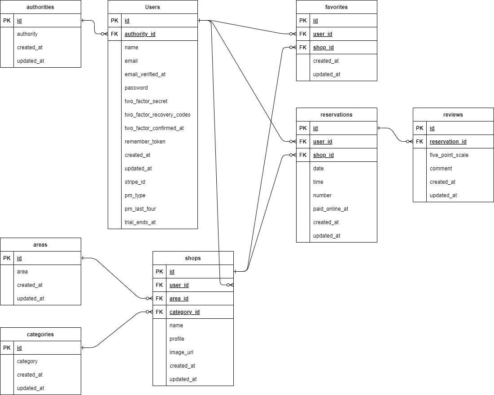

# Rese

## 概要

## 機能一覧

## 使用技術
- Docker
- Laravel:8.83.8
- Fortify:1.19.1
- MailHog
- nginx:1.21.1
- php:7.4.9
- MySQL:8.0.26
- phpMyAdmin

## ER図

## テーブル設計
### Users
|カラム名|型|PRIMARY KEY|UNIQUE KEY|NOT NULL|FOREIGN KEY|説明|
|----|----|:--:|:--:|:--:|:--:|----|
|id|unsigned bigint|○||○||主キー|
|authority_id|unsigned bigint|||○|○|外部キー、通常の会員登録でのデフォルトは「3:利用者権限」|
|name|varchar(255)|||○||ユーザー名|
|email|varchar(255)||○|○||メールアドレス|
|email_verified_at|timestamp|||||メール認証実行の有無|
|password|varchar(255)|||○||パスワード|
|two_factor_secret|text||||||
|two_factor_recovery_codes|text||||||
|two_factor_confirmed_at|timestamp||||||
|remember_token|varchar(100)||||||
|created_at|timestamp|||||登録日時|
|updated_at|timestamp|||||更新日時|
#### Usersテーブルのデフォルトユーザーについて
以下のデフォルトユーザーが登録されています。
各ユーザーのメールアドレスとパスワードについては別途資料を確認してください。
|id|デフォルトユーザー名|説明|設定環境|
|----|----|----|----|
|1|admin|管理者権限のユーザー|本番、開発両方の環境で設定されます|
|2|testManager|店舗代表者権限のテスト用ユーザー|開発環境で飲み設定されます|
|3|testUser1|利用者権限のテスト用ユーザー|開発環境で飲み設定されます|
|4|testUser2|利用者権限のテスト用ユーザー|開発環境で飲み設定されます|
|5|testUser3|利用者権限のテスト用ユーザー|開発環境で飲み設定されます|
### テーブル名
|カラム名|型|PRIMARY KEY|UNIQUE KEY|NOT NULL|FOREIGN KEY|説明|
|----|----|:--:|:--:|:--:|:--:|----|
||||||||
||||||||
||||||||

## URL
- 開発環境：http://127.0.0.1/
- 本番環境：http://
- phpMyAdmin：http://〇.〇.〇.〇:8080/
- MailHog：http://〇.〇.〇.〇:8025/
※「〇.〇.〇.〇」には各環境のIPアドレスを入れてください。

## 開発環境構築
### Dockerビルド
1. `git clone git@github.com:mdotplus/〇〇〇〇〇〇.git`
1. `docker compose up -d --build`
### Laravel環境構築
1. `docker compose exec php bash`
1. `composer install`
1. .env.exampleファイルを複製して.envファイルを作成し、データベースに関する環境変数を変更
1. `php artisan key:generate`
1. `php artisan migrate`
1. `php artisan db:seed`
